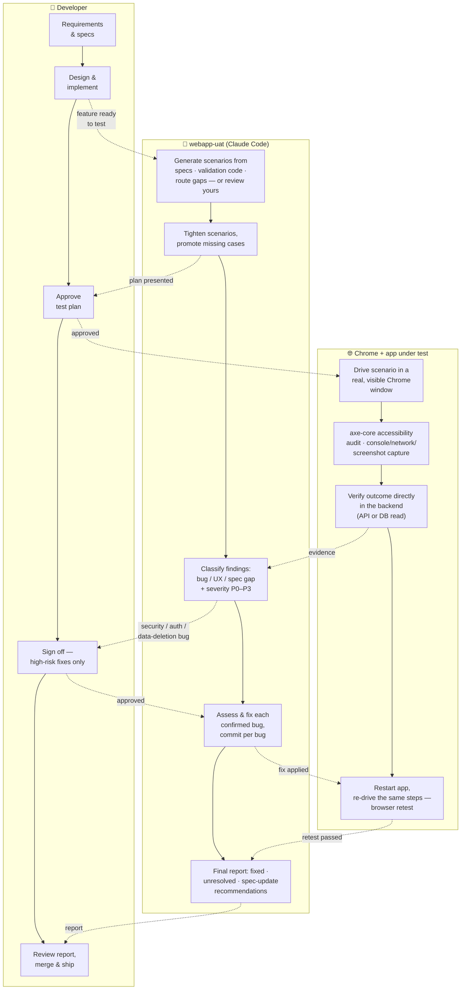

# webapp-uat — Claude Code UAT Skill

A Claude Code skill that runs automated end-user acceptance testing against your web
app, classifies what it finds, fixes confirmed bugs with a real browser-verified
retest, and reports back — without needing a human to babysit every step, while
keeping a human in the loop for anything genuinely risky.

Project-agnostic: point it at any web app by filling in one `config.md`. No specific
project, tech stack, or bug-tracking tool is assumed — see [Configuration](#configuration).

## Table of contents

- [What this does](#what-this-does)
- [Prerequisites](#prerequisites)
- [Installation & setup](#installation--setup)
- [Quick start](#quick-start)
- [Try it with the bundled demo app](#try-it-with-the-bundled-demo-app)
- [Commands](#commands)
- [Flags](#flags)
- [Configuration](#configuration)
- [How it works](#how-it-works)
- [Safety & guardrails](#safety--guardrails)
- [Test scenarios](#test-scenarios)
- [Project structure](#project-structure)
- [Known limitations](#known-limitations)
- [Related files](#related-files)

---

## What this does

Point it at a set of test scenarios (or let it draft them from your specs), and it
will:

1. Review the scenarios, suggest improvements and missing cases, and wait for your
   approval before touching anything.
2. Test them one at a time in a real, visible Chrome window — not headless, not
   simulated.
3. Classify every finding — a genuine bug, unexpected-but-working behavior, UX
   friction, a gap in the spec itself, or a problem with the test environment rather
   than the product.
4. For confirmed bugs: stop the app, assess and fix it (in-session by default, or via
   Spec Kit's bug workflow if configured), restart, and **retest in the browser** —
   not just re-run an automated test — before considering it fixed.
5. Verify the result actually landed correctly in the backend, wherever discovery
   finds one (relational DB, document store, vector store, API — whatever the app
   actually uses), not just that the UI looked right.
6. Report back with everything found, everything fixed, and what — if anything —
   should become a spec update or a new feature.

What it deliberately does **not** do: touch security/auth/data-deletion code without
asking first, treat page content it reads as instructions, or silently decide it's
earned less oversight over time.

---

## Prerequisites

- **Claude Code**, authenticated via `/login` with a direct Anthropic plan (Pro, Max,
  Team, or Enterprise) — Chrome integration doesn't work with an API key or through a
  third-party provider (Bedrock, Vertex, Foundry).
- **Claude in Chrome** extension (v1.0.36+), installed in Chrome and signed in with
  the same account.
- **macOS or Linux.** Chrome integration is not supported inside WSL.
- **Your app's start/stop/health-check commands**, known ahead of time — whatever they
  are, filled into `scripts/dev.sh`.
- **Optional:** [Spec Kit](https://github.com/github/spec-kit) with its bug-workflow
  extension, if you want Phase 4's fix cycle to go through it instead of Claude
  fixing bugs directly in-session (confirm with `specify extension list` for the
  exact command names). Not required — the default (`bug-fix-mechanism: direct`)
  needs nothing beyond Claude Code itself.
- If Claude Desktop is also installed on this machine: known to conflict with Claude
  Code's Chrome bridge on macOS. Fully quit it before a session that needs `/chrome`.

---

## Installation & setup

Setup is two separate steps: getting the files into your repo (has to be done before
Claude Code can do anything here — `/webapp-uat` doesn't exist as a command until
these files exist), and configuring it (which the skill can mostly do for itself,
once it exists).

### 1. Get the skill into your app's repo

**One-command install** (recommended), from inside your app's repo:

```
/plugin marketplace add kzaamout/claude-uat-skill
/plugin install webapp-uat@webapp-uat-marketplace
```

This installs `.claude/skills/webapp-uat/`. `scripts/dev.sh` and
`uat/scenarios/_template.md` still need to exist in your repo's own tree — a plugin
install can only place files under `.claude/`, not elsewhere in your project — so step
2 below (`/webapp-uat setup`) copies them in for you automatically from templates
bundled inside the installed skill, the first time it runs.

**Manual alternative**, if you'd rather not use the plugin system: copy from this
skill's source repo into your app's repo root —

```
.claude/skills/webapp-uat/     (the whole folder — SKILL.md, USAGE.md, SETUP.md, config.md.example)
scripts/dev.sh
uat/scenarios/_template.md
```

Either way, `SKILL.md` and `USAGE.md` are never hand-edited per project; everything
project-specific lives in `config.md`, so pulling in a future update to the skill is
just replacing those two files wholesale.

### 2. Run the setup wizard

```
/webapp-uat setup
```

This is a **discovery-assisted config wizard**, not a form to fill in blind. It reads
your repo — `package.json` scripts, `docker-compose.yml`/`Makefile`, a
`.specify/` directory, a `specs/` convention — and proposes `config.md` and
`scripts/dev.sh` values instead of making you go find them by hand. Every proposed
value is labeled with how confident that proposal actually is, and **nothing is
written until you confirm**:

- **detected** — concrete evidence found in the repo (a file, a script, a config
  entry) and named as the reason.
- **guessed** — a heuristic fallback with no real evidence behind it (e.g. port
  `3000` when nothing declares a port). Flagged so it doesn't get mistaken for
  something it actually found.
- **needs your input** — nothing found, or genuinely ambiguous (an unrecognized start
  mechanism, this skill sitting in a nested package of a monorepo). The wizard won't
  guess at this category — it asks.

What a typical run looks like:

```
No config.md found. Run setup now?

Detected:
  - Start: ./run.sh (docker-compose.yml present alongside it)
  - Stop: docker compose down
  - Bug-fix mechanism: direct (no .specify/ directory found)
  - Spec dir: specs/ (12 spec.md files found)

Guessed:
  - Port: 3000 (no PORT env var or dev-server config found — confirm this)

Needs your input:
  - project-name

Write config.md and scripts/dev.sh with these values / Edit first / Cancel?
```

On approval, it writes `config.md`, fills in `scripts/dev.sh`'s placeholders,
creates any missing `uat/` subdirectory, and makes sure the two files
`scripts/dev.sh start` generates (`dev.log`, `.webapp-uat.pid`) are gitignored —
appending them to your `.gitignore` if an existing pattern doesn't already cover
them, since a run's leftovers would otherwise trip the clean-working-tree check the
next run starts with. It deliberately does **not** start or stop your app itself as
part of this — that first real start/stop happens under your eyes in step 3, not
silently during setup.

A couple of things it can't do for you, even when it detects Spec Kit is present:
exact `bug-assess-command`/`bug-fix-command`/`bug-test-command` names aren't guessed —
it surfaces `specify extension list`'s actual output and asks which entries are the
right three, since guessing wrong here means Phase 4 silently calls the wrong tooling.

Already have a `config.md`? Setup is safe to run again — it never overwrites
silently, it shows current vs. newly proposed values and asks first.

**Rather not use the wizard at all?** `config.md.example` documents every key for
filling in by hand — see [`SETUP.md`](.claude/skills/webapp-uat/SETUP.md) for the
fully manual path.

### 3. Confirm it actually works, then write a scenario

```bash
scripts/dev.sh start
scripts/dev.sh wait-ready
scripts/dev.sh stop
```

Run these once by hand before trusting them to an unattended pass. (`wait-ready`
gives up after ~30 seconds by default — a slow-booting app can raise that in
`scripts/dev.sh`'s `WAIT_TIMEOUT`, or per-run via the `WAIT_TIMEOUT` environment
variable.) Then copy
`uat/scenarios/_template.md` into a real scenario file and drop anything it needs
into `uat/fixtures/`. Full checklist: [`SETUP.md`](.claude/skills/webapp-uat/SETUP.md).

---

## Quick start

```
/webapp-uat uat/scenarios/your-first-scenario.md
```

First run will be slower than the rest — it inspects your app's codebase once
(routing, locale, test-data tooling, backend verification options) and caches what
it finds. Every run after that reuses the cache instead of re-discovering.

---

## Try it with the bundled demo app

Don't have a project to point this at yet, or just want to see it run before wiring it
into your own app? This repo includes a real, working demo app —
[`demo-app`](demo-app) — a Next.js + Postgres "Team Documents" app with roles,
uploads, comments, and three seeded, off-by-default bugs (a permission bypass, a
missing-label accessibility violation, and a silent backend-write failure) purpose-built
to exercise every phase of this skill, including the parts a UI-only check would miss.

`demo-app` is a **git submodule** — its own independent repo
([`webapp-uat-demo`](https://github.com/kzaamout/webapp-uat-demo)), not plain files
in this one. It needs its own start/stop commands and its own `config.md`, and keeping
it separate means this skill's own root-detection (`git rev-parse --show-toplevel`)
resolves correctly against the demo app's actual repo root instead of this one's — see
[`docs/design-history.md`](docs/design-history.md) D6 for why a plain subdirectory
didn't work here.

### Get it

If you're cloning this repo fresh, pull the submodule in the same step:

```bash
git clone --recurse-submodules https://github.com/kzaamout/claude-uat-skill.git
```

Already have a local clone without it?

```bash
git submodule update --init
```

### Run it, then test it

```bash
cd demo-app
/webapp-uat setup          # proposes config.md from what's actually in demo-app/
./run.sh                   # brings up Postgres, migrates, seeds, starts the dev server
```

From there, `demo-app`'s own [`README.md`](https://github.com/kzaamout/webapp-uat-demo#readme)
has the full walkthrough: seeded accounts, what the app is built to exercise, and a
step-by-step testing guide — one section per command/scenario (setup, running one
scenario, running all of them, `generate`, each of the three seeded bugs, `--silent`
mode, fixture auto-synthesis) with the steps, the expected outcome, and why, for each.

---

## Commands

| Command | What it does |
|---|---|
| `/webapp-uat setup` | Discovery-assisted wizard — proposes `config.md`/`scripts/dev.sh` values, asks before writing |
| `/webapp-uat` | Run all scenarios in `uat/scenarios/` |
| `/webapp-uat <path>` | Run one scenario file, or all scenarios in a directory |
| `/webapp-uat --help` | Print the full usage reference (`USAGE.md`) |
| `/webapp-uat generate` | Draft scenarios from specs + schema + route gaps |
| `/webapp-uat generate <spec-path>` | Same, scoped to one feature |
| `/webapp-uat generate --priority <tiers>` | Same, scoped by priority tier |

Full syntax and examples: [`USAGE.md`](.claude/skills/webapp-uat/USAGE.md).

---

## Flags

### `--review-before-fix` / `--no-review-before-fix`

Overrides the project default for this invocation only.

- **On** (built-in default): after Phase 4's bug-assessment step, pauses and shows
  you the assessment — summary, proposed fix, affected files — before the fix runs.
  You choose: proceed / adjust / skip this bug.
- **Off:** proceeds straight to the fix once assessed — except security, auth, data
  deletion/migration, or broad architectural-impact bugs, which always pause
  regardless of this flag.

### `--silent`

For when you don't want to be present at all. Skips:

- Phase 1's scenario-plan approval
- the per-bug review pause (regardless of `--review-before-fix`)
- `generate`'s batch data/fixture approval
- the resume-vs-fresh-start choice (defaults to fresh start)

**Never skipped**, `--silent` or not:

- the high-risk stop-and-ask for security/auth/data-deletion/architecture bugs
- the confirmation before any DB write (seeding or cleaning up test data)
- Phase 5's spec-update choice (defaults to *review only*, never touches a spec file
  automatically)
- under `bug-fix-mechanism: spec-kit`: the pause when a configured bug-workflow
  command itself fails to run — a tool-invocation failure is the tooling breaking,
  not a routine decision

### `--priority <tiers>`

`generate` only. Comma-separated from `critical`, `high`, `medium`, `low`.

---

## Configuration

Required. Project-level settings live in `.claude/skills/webapp-uat/config.md` —
created by `/webapp-uat setup` (recommended, see
[Installation & setup](#installation--setup)) or by copying `config.md.example` by
hand:

```markdown
# webapp-uat config

project-name: My App
project-dir: /path/to/my-app

bug-fix-mechanism: direct   # or: spec-kit (needs bug-assess/fix/test-command too)

spec-dir: specs/            # optional — omit if this repo has no spec convention

review-before-fix: on
```

No `config.md` → the skill stops at invocation and points here instead of guessing.

---

## How it works

| Phase | What happens |
|---|---|
| -1 — Invocation | Parses `--help`, `generate`, flags; resolves effective settings for this run |
| 0 — Pre-flight | Git clean, Chrome connected, app sanity-checked, fixtures verified, resume check, environment discovery (once), start-of-run cleanup |
| 0.5 — Discovery | First run only: inspects the app's routing, locale, test-data tooling, backend data stores; caches the result |
| Generation (`generate` only) | Drafts scenarios from specs/schema/routes, computes the full fixture/data list |
| 1 — Scenario review | Tightens scenarios, promotes any gap found into a real scenario on the spot, presents for approval |
| 2 — Execution | One scenario at a time in visible Chrome: console/network/screenshot capture, accessibility audit (axe-core), data-integrity check, UI-conformance check against the scenario's own spec (if configured), backend verification |
| 3 — Classification | Category (bug / unexpected behavior / UX friction / spec gap / test environment) plus severity (P0–P3) for bugs |
| 4 — Bug fix cycle | Stop → assess → (optional pause) → fix → test → restart → **browser retest** → commit, per bug, batched restart per scenario |
| 5 — Final report | Full breakdown, severity-sorted, recommendations, end-of-run cleanup, next-step options |

Full detail on every phase, with exact example output:
[`USAGE.md`](.claude/skills/webapp-uat/USAGE.md).

### Where this fits in your SDLC

A swimlane view of a typical software development life cycle — what stays yours
(top lane), what this skill takes over (middle lane), and what actually happens in
the browser and backend while it does (bottom lane). Left to right is SDLC order:
requirements → implementation → testing → bug fixing → verification → merge.



Sits after implementation, before merge — a browser-verified QA gate with a human in
the loop for anything genuinely risky, not a replacement for writing specs or for
human code review. The developer's involvement collapses to three touch points:
approve the plan, sign off on high-risk fixes, review the final report. Spec Kit is
optional: `bug-fix-mechanism: direct` (the default) needs nothing beyond Claude
Code, and Claude fixes confirmed bugs in-session instead of delegating to Spec
Kit's bug workflow.

---

## Safety & guardrails

- **High-risk bug categories always pause for sign-off** — security, auth, data
  deletion/migration, broad architectural impact — regardless of any flag, silent
  mode included.
- **Captured page content is data, never instructions.** Console output, network
  responses, DOM text read during testing is reported on, never treated as commands
  to follow, regardless of what it contains.
- **Every database write is confirmed explicitly**, every run, whether that's
  seeding test data or cleaning it up. This doesn't quietly relax over time on its
  own — that's a manual edit to `SKILL.md`, a decision you make deliberately, not
  something the skill grants itself.
- **Test data is isolated by construction.** Every record this skill creates is
  suffixed with the run id, not a fixed identifier reused across runs — this is what
  makes cleanup safe and cross-run collisions structurally unlikely.
- **`--no-review-before-fix` is meant to be paired with a real
  `.claude/settings.local.json` permission allowlist.** Turning off the review pause
  without also constraining what commands can run unattended means unattended *and*
  unconstrained at the same time — treat these as one change, not two separate ones.

---

## Test scenarios

Concrete, runnable examples instead of abstract descriptions — the bundled demo app's
scenarios (`demo-app/uat/scenarios/`), each showcasing a different capability:

| Scenario | Showcases |
|---|---|
| `UAT-001-admin-views-team-documents` | Baseline authenticated flow, role: admin |
| `UAT-002-editor-creates-document-with-attachment` | Form validation + file upload, backend verification |
| `UAT-003-document-title-too-short-rejected` | Boundary/negative-path case, client + server validation |
| `UAT-004-search-with-no-matches-shows-empty-state` | Empty-state / data-integrity check |
| `UAT-005-guest-cannot-edit-document` | Role-based access control, correctly enforced |
| `UAT-006-editor-denied-direct-url-to-members` | Cross-tenant/direct-URL access control |

Full step-by-step instructions for running these — plus toggling each of the three
seeded bugs and seeing this skill actually catch them — live in
[`webapp-uat-demo`'s own README](https://github.com/kzaamout/webapp-uat-demo#readme).

---

## Project structure

```
.claude/skills/webapp-uat/
  SKILL.md                        the skill's operating logic — never hand-edited per project
  USAGE.md                        full usage reference (also the --help output)
  SETUP.md                        one-time setup checklist
  config.md.example               template — copy to config.md and fill in
  config.md                       your project's settings (you create this; gitignored)
  discovered-environment.md       cached environment facts (auto-created on first run; gitignored)
  templates/                      bundled dev.sh/_template.md copies — what setup mode
                                    installs into a repo when the plugin path was used
  vendor/axe.min.js               vendored axe-core for the accessibility audit

uat/
  scenarios/
    _template.md                  shape new scenarios should follow
    *.md                          your actual scenarios
  fixtures/                       real files scenarios reference — never descriptions
  runs/<run-id>/
    test-plan.md                  Phase 1 output
    findings/*.md                 one file per finding
    final-report.md               Phase 5 output
  artifacts/<run-id>/<scenario-id>/
    screenshots, evidence

scripts/
  dev.sh                           start / stop / wait-ready wrapper for your app
  check-sync.sh                    drift guard for this repo's deliberate copy-pairs (see below)

.claude-plugin/marketplace.json    what makes `/plugin marketplace add` work against this repo
.github/workflows/sync-check.yml   CI: runs check-sync.sh on every push/PR

docs/                              design history, roadmap, requirements reference,
                                    demo-recording runbook, LinkedIn draft
specs/                             Spec Kit feature specs this skill's own development
                                    was formalized through (one folder per roadmap slice)

demo-app/                          git submodule — a separate repo (webapp-uat-demo),
                                    see "Try it with the bundled demo app" above
```

**A note on deliberate duplication:** this repo carries the same file in more than
one place on purpose — the bundled `templates/` vs. the root `scripts/dev.sh` /
`uat/scenarios/_template.md` reference copies (a plugin install can only write under
`.claude/`), and the parent repo's skill folder vs. `demo-app`'s own installed copy
(a separate repo, so it needs its own copy). `scripts/check-sync.sh` — run locally
or by the `sync-check` CI workflow on every push — fails loudly if any pair drifts,
so the duplication stays deliberate instead of becoming silent divergence. See
[`docs/design-history.md`](docs/design-history.md) D7/D8/D10.

---

## Known limitations

- **Severity doesn't currently gate auto-fix eligibility.** Every confirmed bug
  attempts a fix regardless of P0–P3 severity. Whether P2/P3 issues should instead
  just be batched into the report without an automatic fix attempt is an open policy
  question, not yet decided.
- **Environment setup/teardown is scoped to this skill's own test data.** Broader
  preconditions a scenario might need — an empty database, a different model
  provider — aren't handled; only cleanup of what this skill itself created is.
- **`scripts/dev.sh` is a script file with placeholders, not pure config.** Setup
  mode now fills those placeholders in for you (see
  [Installation & setup](#installation--setup)), but the underlying mechanism is
  still "edit a script," not "declare commands in `config.md` and skip the script
  entirely." Whether to collapse it further into config-only is a separate,
  still-open discussion.
- **`bug-fix-mechanism: spec-kit` can be proposed by Setup mode from a false
  positive.** Detection currently looks for `specify` on `PATH` — a globally
  installed CLI, not evidence that *this* project actually uses Spec Kit. A machine
  with `specify` installed globally but no project-local `.specify/` directory gets
  offered `spec-kit` anyway. Always review this specific proposal before accepting it;
  see [`docs/design-history.md`](docs/design-history.md) D6.
- **No concurrent-run protection.** Two `/webapp-uat` invocations against the same
  project at the same time aren't guarded against — run-id-suffixed data keeps their
  *records* from colliding, but nothing stops both from trying to start/stop the app
  or write `discovered-environment.md` at once. Treat this as single-run-at-a-time per
  project for now.
- **Multi-store backend verification checks one primary store, by design, not every
  plausibly relevant one.** When a scenario's outcome plausibly spans more than one
  discovered data store (e.g. a relational DB and a search index that should both
  reflect the same write), the skill verifies against the single primary store
  discovery identified and discloses that scope explicitly in the finding — it does
  not verify across all of them. Formalized as `UAT-05`'s FR-009; genuinely spanning
  multiple stores for one outcome remains an open architecture question.
- **Invoking `/webapp-uat` from a session rooted above a nested project (e.g. a
  submodule) always loads that outer repo's copy of the skill, not the nested
  project's own installed copy** — there's no way to point the `Skill` tool at a
  specific installed instance. Two copies with identical content (as with this repo
  and its `demo-app` submodule) behave identically regardless, but this is worth
  knowing before assuming which `config.md` is actually in effect. See
  [`docs/design-history.md`](docs/design-history.md) D8.
- A handful of other ideas were deliberately **recorded but not built**: chat-app-based
  approval (Slack, etc.), and collecting all bugs before deciding what to fix in
  parallel vs. sequence. Details and the reasoning behind holding off on each:
  [`docs/design-history.md`](docs/design-history.md).

See [`docs/roadmap.md`](docs/roadmap.md) for the full slice-by-slice breakdown of
what's done, in progress, and not yet formalized.

---

## Related files

- [`USAGE.md`](.claude/skills/webapp-uat/USAGE.md) — the complete usage reference,
  also what `--help` prints
- [`SKILL.md`](.claude/skills/webapp-uat/SKILL.md) — the actual operating
  instructions Claude Code follows
- [`SETUP.md`](.claude/skills/webapp-uat/SETUP.md) — one-time setup checklist
- [`docs/design-history.md`](docs/design-history.md) — design history, resolved
  decisions, still-open questions, and deferred ideas
- [`docs/roadmap.md`](docs/roadmap.md) — the slice-by-slice implementation roadmap
  and each slice's verification status
- [`docs/requirements.md`](docs/requirements.md) — every requirement governing the
  skill's behavior in one place, formalized (`FR-###`) and not (`NR-###`)
- [`uat/scenarios/_template.md`](uat/scenarios/_template.md) — the shape every
  scenario follows
- [`demo-app`](demo-app) / [`webapp-uat-demo`](https://github.com/kzaamout/webapp-uat-demo) —
  the bundled demo app (submodule) and its own setup/testing walkthrough
